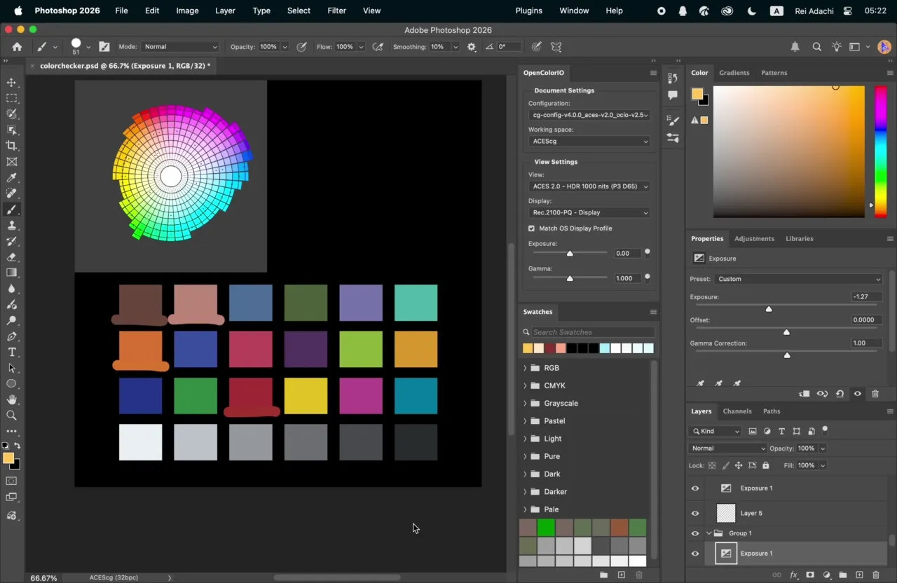
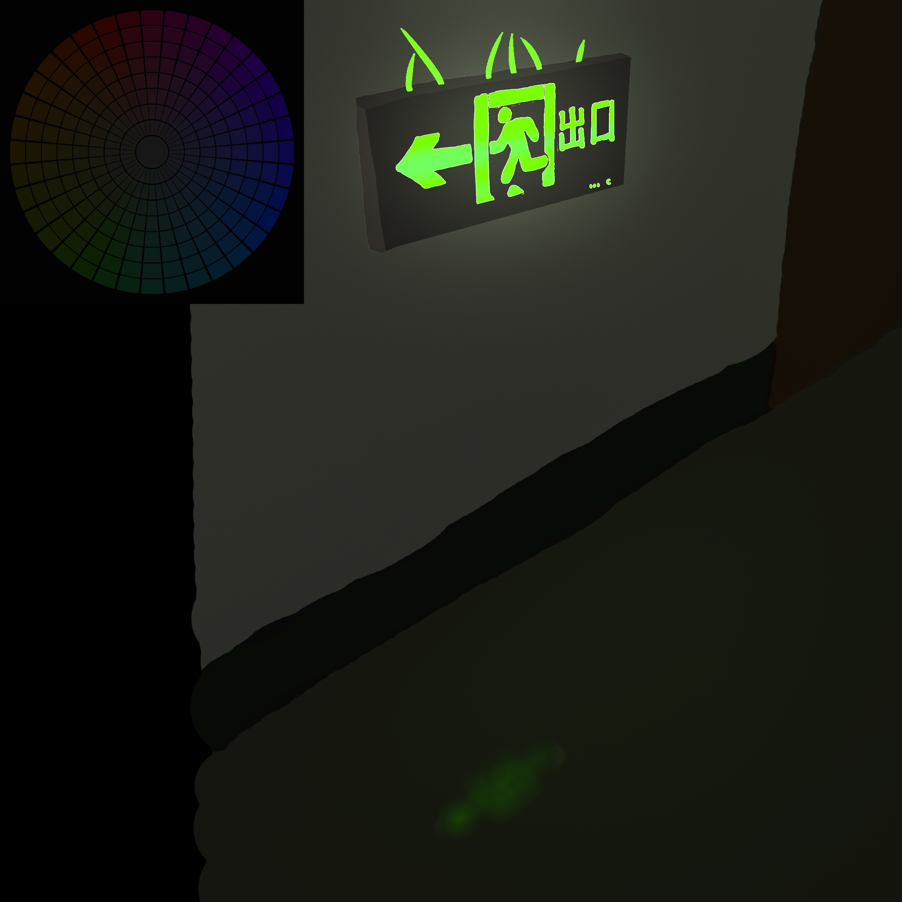

*Demo: `P3-GamutCone_ACES2-Rec2020-PQ-Compensated_ACEScg-fp32.exr` is loaded (top-left) into a Photoshop document configured with the ACES 2.0 OCIO config, along with a 24-patch ColorChecker chart (bottom). For each of three patches, the eyedropper samples a color from the palette, a brush stroke is applied over the matching patch, and exposure is adjusted until the painted color matches the reference. The document uses Display = `Rec.2100-PQ - Display` and a View suited to the delivery target and the author’s laptop screen (HDR 1000 nit, P3-D65, Match OS Display Profile), which aligns with the palette’s compensation target (ACES 2.0 Rec.2020 / Rec.2100-PQ, 1000 nit).*

# modCAM16-HK Palettes

Language / 语言: [English](README.md) | [中文](README.zh.md)

Perceptually equal-brightness color palettes for painting, texturing, and ACES workflows.

The palettes compensate for the **Helmholtz–Kohlrausch effect**: highly chromatic colors can appear brighter than neutral colors at the same measured luminance. They are useful for:

- painting base (local) colors with consistent perceived brightness;
- separating color selection from exposure adjustment during painting or base-color texture work;
- selecting colors for an ACES 2.0 display transform;
- using ColorChecker patches as familiar color-selection references.

## Release palettes

Download the five `.exr` files from [Releases](../../releases).

All release files share the same EXR encoding: scene-linear ACEScg/AP1, three-channel RGB, IEEE float32. An `sRGB` or `P3` filename describes the palette’s color boundary. The EXR itself remains ACEScg/AP1.

| File | Palette gamut | Required ACES display transform | Intended use |
| --- | --- | --- | --- |
| `sRGB-GamutCone_ACEScg-fp32.exr` | sRGB-D65 | None | General painting and texture work restricted to sRGB colors |
| `P3-GamutCone_ACEScg-fp32.exr` | P3-D65 | None | General wide-gamut painting and texture work |
| `AP1-GamutCone_ACEScg-fp32.exr` | ACEScg/AP1 | None | ACES or wide-gamut scene-linear workflows |
| `sRGB-GamutCone_ACES2-Rec709-BT1886-Compensated_ACEScg-fp32.exr` | sRGB-D65 | ACES 2.0 Rec.709 / BT.1886, 100 nit | ACES 2.0 SDR work |
| `P3-GamutCone_ACES2-Rec2020-PQ-Compensated_ACEScg-fp32.exr` | P3-D65, constrained to Rec.2020 | ACES 2.0 Rec.2020 / Rec.2100-PQ, 1000 nit | ACES 2.0 HDR production |

“None” means that the palette is compensated for H–K only, while normal color management or display conversion still applies.

## How to use

### 1. Load the EXR as scene-linear ACEScg

All release files use AP1 primaries and float32 linear RGB. Treat the filename gamut as the palette’s color boundary, and treat the EXR encoding as ACEScg/AP1.

### 2. Choose a palette

Follow this decision tree:

1. **Does your workflow include an ACES display transform?**
   - **No** → use a compensated-for-H–K-only (“direct”) palette; continue to step 2.
   - **Yes** → use a display-compensated palette; continue to step 3.

2. **(No ACES display transform) Which direct palette?**
   - Default: use the **direct P3** palette.
   - Restricted to sRGB colors: use the **direct sRGB** palette.
   - ACEScg/AP1 colors with a non-ACES-2.0 display transform (for example OpenDRT v1.0.0): try the **direct ACEScg/AP1** palette.

3. **(ACES 2.0 display transform) SDR or HDR delivery?**
   - **SDR video/image** → use the palette compensated for **ACES 2.0 Rec.709 / BT.1886**.
   - **HDR video/image** → use the palette compensated for **ACES 2.0 Rec.2020 / Rec.2100-PQ, 1000 nit**.

Use a compensated palette with its exact matching ACES 2.0 display transform and display peak.

As shown in the demo above, a compensated palette produces a correct color match only when it is paired with its matching ACES 2.0 display transform and View. The demo confirms this: the H–K-compensated palette, the color/exposure-separated sampling workflow, and the ColorChecker references all behave as intended because the document’s Display and View match the palette’s compensation target.

### 3. Select colors from the radial layout

- Angle represents hue.
- Distance from the center represents chroma.
- The outer narrow band shows the available gamut boundary for each hue.
- ColorChecker dots mark the first 18 chromatic patches and serve as selection references.

For a color/exposure-separated workflow, choose the base color from the palette, then adjust brightness with a scene-linear exposure operation while keeping the same base color.

## Example artwork



This HDR piece was painted by the author with an early development build of the palette, equivalent to today’s **direct ACEScg/AP1** variant, paired with a non-ACES-2.0 display transform (OpenDRT v1.0.0 Default) and graded afterward in DaVinci Resolve. While the direct P3 and sRGB palettes cover the most common workflows, the direct ACEScg/AP1 palette remains a capable choice for wide-gamut painting under alternative display transforms.

## Scientific basis

At equal photometric luminance, chromatic stimuli can appear brighter as their colorfulness increases. This Helmholtz–Kohlrausch effect has been incorporated into revised CAM16 formulations by Hellwig, Stolitzka, and Fairchild [1,2]. The release palettes use the revised H–K lightness correlate

`J_HK = sqrt(J² + 66 C)`

and solve colors so that hue and chroma can vary while the model-predicted brightness remains approximately constant. Gamut limits are solved independently for each hue.

Conventional RGB painting controls generally provide a measured-luminance control rather than an H–K-corrected brightness invariant. ACES 2.0 provides a scene-to-display rendering transform and leaves color selection to the artist [5]. The direct palettes therefore apply H–K compensation during palette construction, while the ACES variants additionally compensate for the selected ACES 2.0 display transform.

The implemented equations correspond to the revised CAM16 and H–K equations described in [1,2]. The earlier additive H–K extension in [4] is related work and stands apart from the model used here. ACES-compensated palettes are solved and round-trip checked with the bundled ACES 2.0 OCIO configuration; the configuration, display transform, and error diagnostics are stored in the EXR metadata.

Results remain appearance-model predictions and depend on the assumed viewing conditions, display transform, and display calibration.

## Generate locally

Python 3.11 or newer is required.

```sh
python3 -m pip install -e .
python3 make_release.py
```

This generates the same five palette variants using `config.release.toml`.

## Licensing

Unless a file or directory says otherwise, the original source code and tests
in this repository are licensed under Apache-2.0; see [`LICENSE`](LICENSE).
The five generated release palette EXRs published on this repository's GitHub
Releases page are dedicated to the public domain under CC0-1.0; see
[`LICENSE-CC0-1.0.txt`](LICENSE-CC0-1.0.txt).  The release assets include a
copy of that notice for standalone distribution.  The bundled
ACES OCIO configuration is third-party material under its upstream
BSD-3-Clause license; see [`THIRD_PARTY_NOTICES.md`](THIRD_PARTY_NOTICES.md).
The CC0 dedication covers only rights held in the generated palette artifacts;
it does not grant rights in third-party ColorChecker names/data, ACES marks or
transforms, or other referenced material.  Demo artwork and screenshots are
separate media and are not covered by the palette CC0 dedication.

## References

1. Hellwig, L., Stolitzka, D., and Fairchild, M. D. “The brightness of chromatic stimuli.” *Color Research & Application* (2024). [doi:10.1002/col.22910](https://doi.org/10.1002/col.22910)
2. Hellwig, L., Stolitzka, D., and Fairchild, M. D. “Improvements to CIECAM16 and Future Directions.” *CIE 2023 Proceedings* (2023). [doi:10.25039/x50.2023.pp011](https://doi.org/10.25039/x50.2023.pp011)
3. Stolitzka, D., Agahian, F., and Poynton, C. “Modeling the HDR Display with XCR.” *Information Display* (2025). [doi:10.1002/msid.1596](https://doi.org/10.1002/msid.1596)
4. Hellwig, L., Stolitzka, D., and Fairchild, M. D. “Extending CIECAM02 and CAM16 for the Helmholtz–Kohlrausch effect.” *Color Research & Application* (2022). [doi:10.1002/col.22793](https://doi.org/10.1002/col.22793)
5. Academy Color Encoding System. “Output Transforms.” [ACES Documentation](https://docs.acescentral.com/system-components/output-transforms/)
